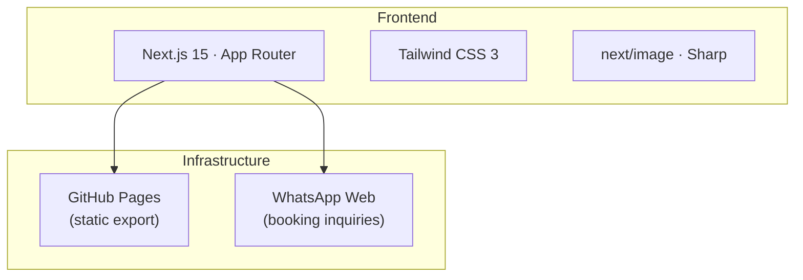
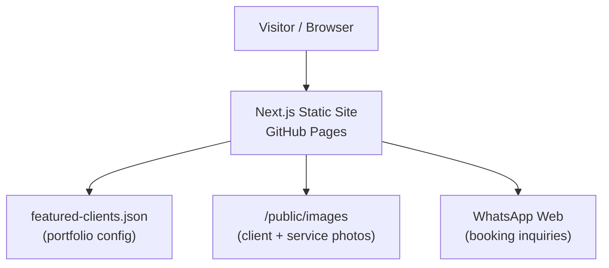
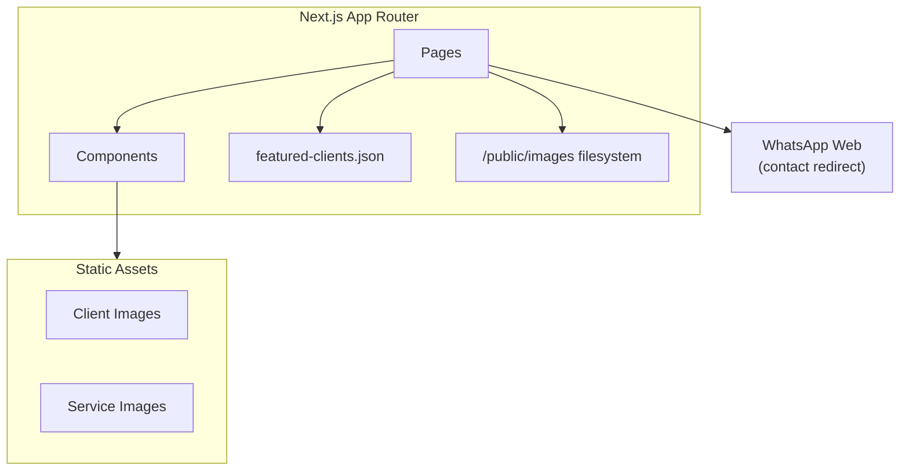
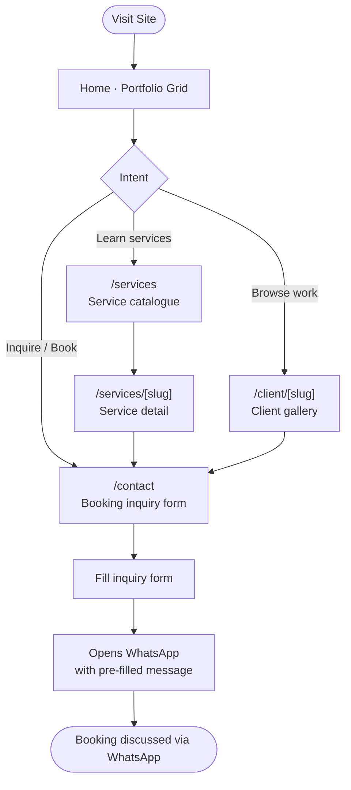
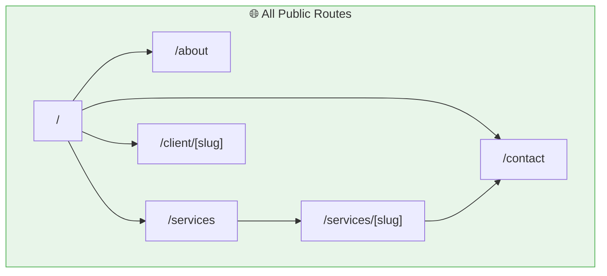
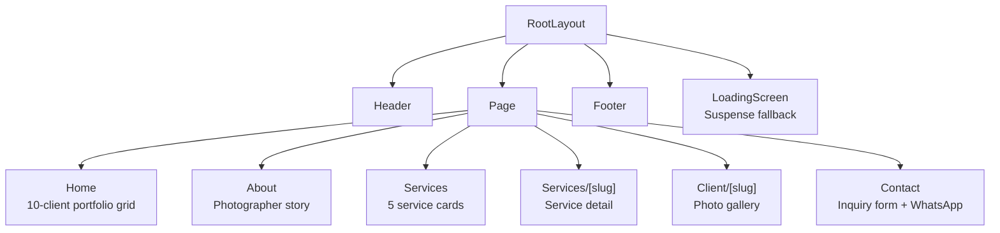
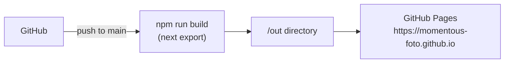

# 📸 momentous-foto

> Photography portfolio and booking inquiry site for a Malaysian wedding and lifestyle photographer.


---

## 📖 Table of Contents

- [Overview](#-overview)
- [Features](#-features)
- [Tech Stack](#-tech-stack)
- [Architecture](#-architecture)
- [User Flow](#-user-flow)
- [Frontend Components](#-frontend-components)
- [Getting Started](#-getting-started)
- [Deployment](#-deployment)
- [Project Structure](#-project-structure)
- [Roadmap](#-roadmap)
- [License](#-license)

---

## 🧭 Overview

momentous-foto is the main portfolio and inquiry site for Momentous Foto, a Malaysian photography brand specialising in weddings, pre-weddings, maternity, convocations, and events. It showcases featured client work across dynamic gallery pages and routes booking inquiries directly through WhatsApp.

**Type:** `Collaborative`
**Brand:** `Momentous Foto`
**Built with:** Independent

---

## ✨ Features

- ✅ Featured client portfolio grid (10 clients, config-driven)
- ✅ Dynamic client gallery pages (`/client/[slug]`)
- ✅ Service catalogue with 5 photography services
- ✅ Dynamic service detail pages (`/services/[slug]`)
- ✅ Booking inquiry form with WhatsApp integration
- ✅ SEO-optimised with JSON-LD schema (Organisation + Website)
- ✅ Image lazy loading and optimisation with Sharp
- ✅ Mobile-responsive layout
- 💡 Admin panel for managing featured clients *(planned)*
- 💡 Online availability calendar *(planned)*

---

## 🛠 Tech Stack



| Layer | Technology |
|---|---|
| Framework | Next.js 15 (App Router) |
| Language | TypeScript 5 |
| Styling | Tailwind CSS 3 |
| Images | next/image + Sharp |
| Hosting | GitHub Pages (static export) |
| Booking | WhatsApp Web (client-side redirect) |

---

## 📌 Architecture

### High-level Architecture



### System Architecture



---

## 👤 User Flow



### Page Map



---

## 🧩 Frontend Components

### Component Tree



### Key Components

| Component | Purpose |
|---|---|
| `Header` | Fixed navigation with logo, mobile menu, Instagram & Threads links |
| `Footer` | Site footer |
| `LoadingScreen` | Suspense fallback loading UI |

---

## 🚀 Getting Started

### Prerequisites

- Node.js `>=18`

### Installation

```bash
git clone https://github.com/momentous-foto/momentous-foto.github.io.git
cd momentous-foto.github.io/momentous-foto
npm install
```

### Running locally

```bash
# Development
npm run dev

# Production build
npm run build
```

---

## 🔑 Environment Variables

This project is a static export — no server-side environment variables are required.

---

## ☁️ Deployment

| Service | Purpose |
|---|---|
| GitHub Pages | Static site hosting |



Built with `output: 'export'` in `next.config.ts`. The `/out` directory is deployed to GitHub Pages.

---

## 📁 Project Structure

```
momentous-foto/
├── app/
│   ├── about/
│   │   └── page.tsx
│   ├── client/
│   │   └── [slug]/
│   │       └── page.tsx
│   ├── contact/
│   │   └── page.tsx
│   ├── services/
│   │   ├── page.tsx
│   │   └── [slug]/
│   │       └── page.tsx
│   ├── layout.tsx
│   └── page.tsx
├── components/
│   ├── Header.tsx
│   ├── Footer.tsx
│   └── LoadingScreen.tsx
├── config/
│   └── featured-clients.json
├── public/
│   └── images/
│       ├── clients/          ← client photo folders (keyed by slug)
│       └── services/         ← service images
├── next.config.ts
├── tailwind.config.js
└── tsconfig.json
```

---

## 🗺 Roadmap

- [x] Portfolio grid with 10 featured clients
- [x] Dynamic client gallery pages
- [x] Service catalogue with 5 service types
- [x] Dynamic service detail pages
- [x] Booking inquiry form with WhatsApp redirect
- [x] SEO with JSON-LD schema
- [x] Image lazy loading + Sharp optimisation
- [ ] Admin panel for managing featured clients
- [ ] Online availability calendar

---

## 📄 License

MIT © 2026 Momentous Foto
