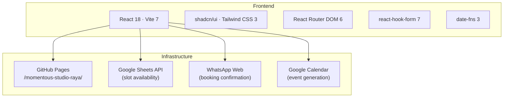
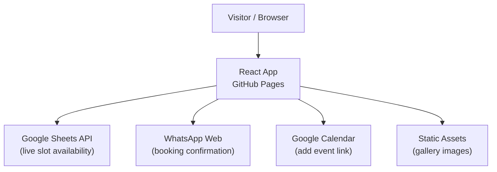
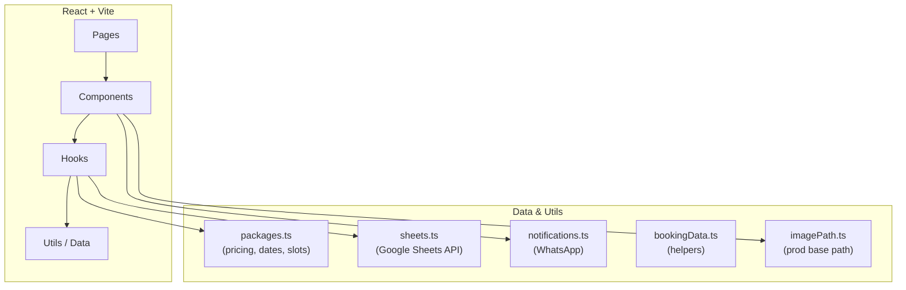
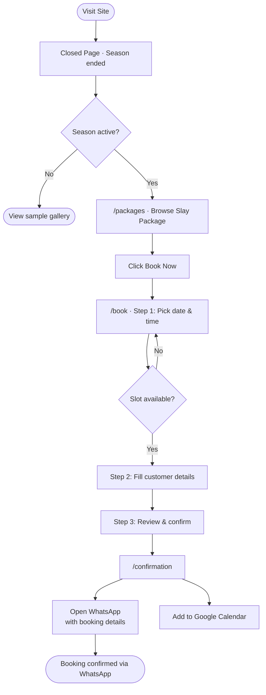
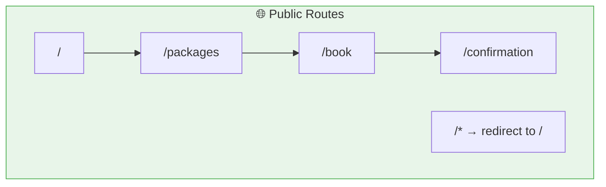
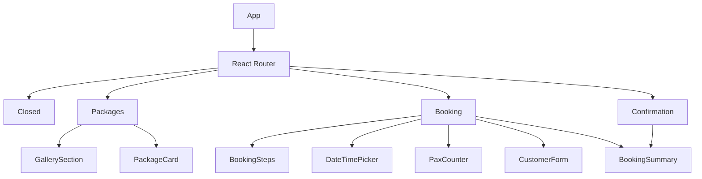
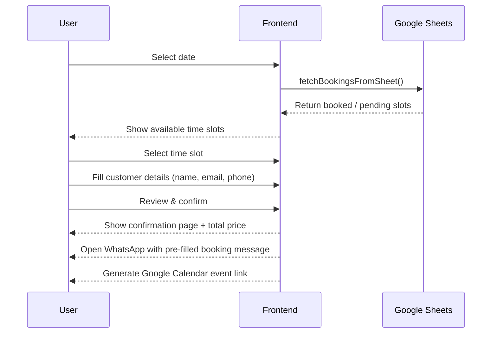
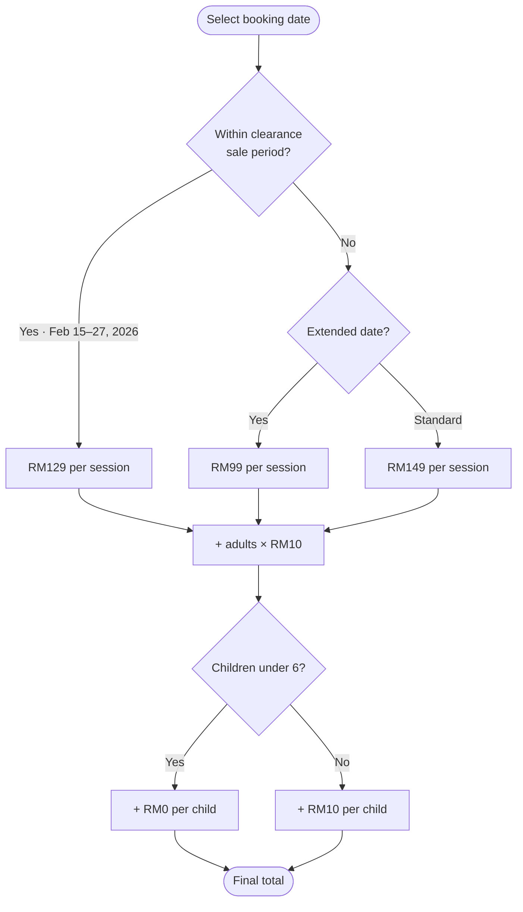
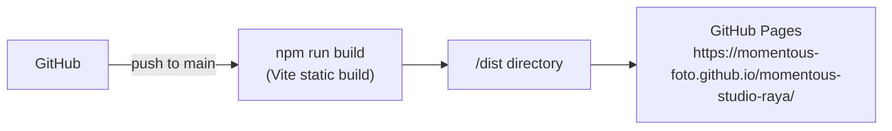

# 🌙 momentous-studio-raya

> Event booking system for the Momentous Foto Raya 2026 outdoor photoshoot season — now closed.


---

## 📖 Table of Contents

- [Overview](#-overview)
- [Features](#-features)
- [Tech Stack](#-tech-stack)
- [Architecture](#-architecture)
- [User Flow](#-user-flow)
- [Frontend Components](#-frontend-components)
- [Feature Flows](#-feature-specific-flows)
- [Getting Started](#-getting-started)
- [Environment Variables](#-environment-variables)
- [Deployment](#-deployment)
- [Project Structure](#-project-structure)
- [Roadmap](#-roadmap)
- [License](#-license)

---

## 🧭 Overview

momentous-studio-raya was the dedicated booking site for Momentous Foto's Raya 2026 outdoor photoshoot event at Bukit Lagong, Batu Caves. It featured a multi-step booking wizard, live slot management via Google Sheets, dynamic clearance-sale pricing, and WhatsApp-based booking confirmation. The 2026 season has ended — the site now displays the Closed page with a sample gallery.

**Type:** `Solo`
**Brand:** `Momentous Foto`
**Built with:** Independent

---

## ✨ Features

- ✅ Multi-step booking wizard (date, time, customer details, confirmation)
- ✅ Live slot availability via Google Sheets API
- ✅ Dynamic pricing with clearance sale date ranges
- ✅ Add-ons system (adults +RM10, children under 6 free)
- ✅ Bento-grid photo gallery with fullscreen lightbox
- ✅ WhatsApp booking notifications (pre-filled message)
- ✅ Google Calendar event generation
- ✅ Image usage consent with scrollable terms
- ✅ Responsive mobile-first layout
- ✅ Closed page with sample gallery (season ended)
- 💡 Backend booking management system *(planned)*
- 💡 Email booking confirmations *(planned)*
- 💡 Admin dashboard for slot management *(planned)*

---

## 🛠 Tech Stack



| Layer | Technology |
|---|---|
| Framework | React 18 + Vite 7 |
| Language | TypeScript 5 |
| Routing | React Router DOM 6 |
| Styling | Tailwind CSS 3 + shadcn/ui |
| Forms | react-hook-form 7 |
| Dates | date-fns 3 |
| Slot data | Google Sheets API |
| Hosting | GitHub Pages (sub-path `/momentous-studio-raya/`) |
| Booking | WhatsApp Web (client-side redirect) |

---

## 📌 Architecture

### High-level Architecture



### System Architecture



---

## 👤 User Flow

> The flow below documents the booking experience when the event was active.



### Page Map



---

## 🧩 Frontend Components

### Component Tree



### Key Components

| Component | Purpose |
|---|---|
| `BookingSteps` | Step indicator showing progress through the booking wizard |
| `DateTimePicker` | Calendar + 15-min time slot selector with live slot availability |
| `PaxCounter` | Increment/decrement counter for adults and children |
| `CustomerForm` | Name, email, phone, notes, and image consent form |
| `BookingSummary` | Booking detail and price summary card |
| `GallerySection` | Bento-grid photo gallery |
| `PackageCard` | Package showcase with pricing and inclusions |
| `Header` | Navigation: Home, Packages, Book Now |
| `Footer` | Footer with social links (Instagram, TikTok, Threads) |
| `FloatingClouds` | Animated background decoration |

---

## ⚙️ Feature-specific Flows

### Booking Wizard Flow



### Dynamic Pricing Flow



---

## 🚀 Getting Started

### Prerequisites

- Node.js `>=18`

### Installation

```bash
git clone https://github.com/momentous-foto/momentous-foto.github.io.git
cd momentous-foto.github.io/momentous-studio-raya
npm install
```

### Running locally

```bash
# Development (http://localhost:8080)
npm run dev

# Production build
npm run build

# Run tests
npm run test
```

---

## 🔑 Environment Variables

```env
# Google Sheets integration (slot availability)
VITE_GOOGLE_SHEETS_API_KEY=
VITE_GOOGLE_SHEET_ID=
```

> The app runs without these set — it will fall back gracefully if the Sheets API is unavailable.

---

## ☁️ Deployment

| Service | Purpose |
|---|---|
| GitHub Pages | Static site hosting at sub-path |



Built with base path `/momentous-studio-raya/` in `vite.config.ts` for GitHub Pages sub-path deployment.

---

## 📁 Project Structure

```
momentous-studio-raya/
├── src/
│   ├── components/
│   │   ├── ui/                  ← shadcn/ui components
│   │   ├── BookingSteps.tsx
│   │   ├── BookingSummary.tsx
│   │   ├── CustomerForm.tsx
│   │   ├── DateTimePicker.tsx
│   │   ├── FloatingClouds.tsx
│   │   ├── Footer.tsx
│   │   ├── GallerySection.tsx
│   │   ├── Header.tsx
│   │   ├── PackageCard.tsx
│   │   ├── PackagesPreview.tsx
│   │   └── PaxCounter.tsx
│   ├── data/
│   │   └── packages.ts          ← pricing, available dates, time slots
│   ├── hooks/
│   │   ├── useBooking.ts        ← booking state, validation, slot logic
│   │   └── usePackages.ts       ← package data and dynamic pricing
│   ├── pages/
│   │   ├── Booking.tsx
│   │   ├── Closed.tsx
│   │   ├── Confirmation.tsx
│   │   └── Packages.tsx
│   ├── utils/
│   │   ├── bookingData.ts
│   │   ├── imagePath.ts         ← resolves prod base path for images
│   │   ├── notifications.ts     ← WhatsApp pre-filled message builder
│   │   └── sheets.ts            ← Google Sheets API integration
│   ├── App.tsx
│   └── main.tsx
├── public/                      ← gallery images
├── vite.config.ts
├── tailwind.config.ts
└── tsconfig.json
```

---

## 🗺 Roadmap

- [x] Multi-step booking wizard
- [x] Live slot availability via Google Sheets
- [x] Dynamic pricing with clearance sale logic
- [x] Add-ons system (adults + children)
- [x] WhatsApp booking notification
- [x] Google Calendar event generation
- [x] Bento-grid gallery with fullscreen lightbox
- [x] Closed page with sample gallery (season ended)
- [ ] Backend booking management system
- [ ] Email booking confirmations
- [ ] Admin dashboard for slot management

---

## 📄 License

MIT © 2026 Momentous Foto
