# 🏠 SurveyLuhh

> A collaborative property scraper for Malaysian house hunters — paste listing URLs, shortlist together, then let a bracket tournament decide your favourite.


---

## 📖 Table of Contents

- [Overview](#-overview)
- [Features](#-features)
- [Tech Stack](#-tech-stack)
- [Architecture](#-architecture)
- [User Flow](#-user-flow)
- [Auth Flow](#-auth--session-flow)
- [Database](#-database-erd)
- [API Structure](#-api-structure)
- [Frontend Components](#-frontend-components)
- [Feature Flows](#-feature-specific-flows)
- [Getting Started](#-getting-started)
- [Environment Variables](#-environment-variables)
- [Deployment](#-deployment)
- [Project Structure](#-project-structure)
- [Roadmap](#-roadmap)
- [License](#-license)

---

## 🧭 Overview

SurveyLuhh solves the group-chat chaos of house hunting — instead of sharing screenshots and arguing over WhatsApp, everyone drops listing URLs into a shared session, the app scrapes the details automatically, and the group votes using a head-to-head bracket tournament. Sessions auto-expire after 7 days so there's no clutter.

**Type:** `Solo`
**Brand:** `Luhh Series`
**Built with:** Independent

---

## ✨ Features

- ✅ One-click session creation with a shareable link
- ✅ Scrape mudah.my, PropertyGuru, and iProperty listings automatically
- ✅ Collaborative property list — all members see the same properties in real time
- ✅ Shortlist / Reject / Delete properties with status badges
- ✅ Bracket tournament (head-to-head voting) to pick a group favourite
- ✅ PDF export of any property detail
- ✅ Anonymous feedback system with admin reply panel
- ✅ Sessions auto-delete after 7 days via MongoDB TTL
- 🚧 WebSocket live sync *(in progress — currently uses 30s polling)*
- 💡 PropertyGuru + iProperty full scraping *(planned — currently blocked by Cloudflare/Akamai)*
- 💡 Price history tracking *(planned)*

---

## 🛠 Tech Stack

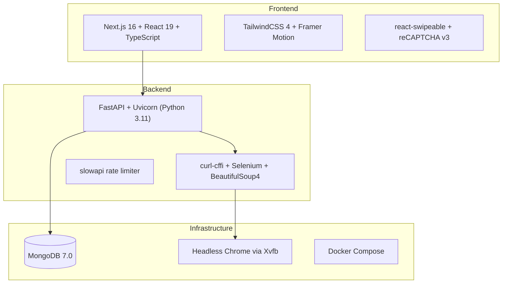

| Layer | Technology |
|---|---|
| Frontend | Next.js 16, React 19, TypeScript |
| Backend | FastAPI, Uvicorn (Python 3.11) |
| Database | MongoDB 7.0 (Motor async driver) |
| Auth | reCAPTCHA v3 (scrape gate), Bearer token (admin) |
| Scraping | curl-cffi, Selenium, BeautifulSoup4, undetected-chromedriver |
| Hosting | Docker Compose (Railway / Vercel / Render) |
| Other | Framer Motion, react-swipeable, slowapi |

---

## 📌 Architecture

### High-level Architecture

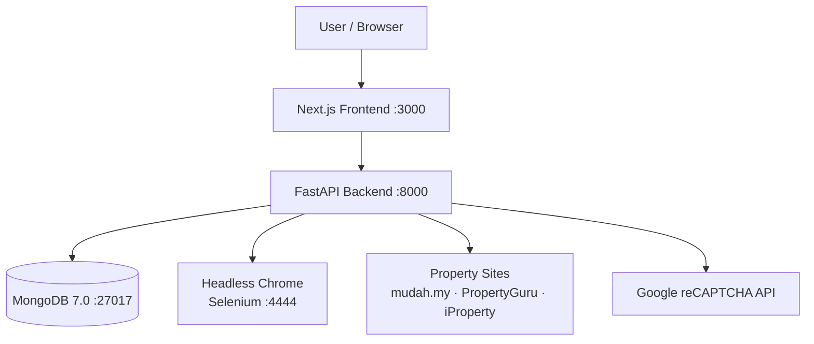

### System Architecture

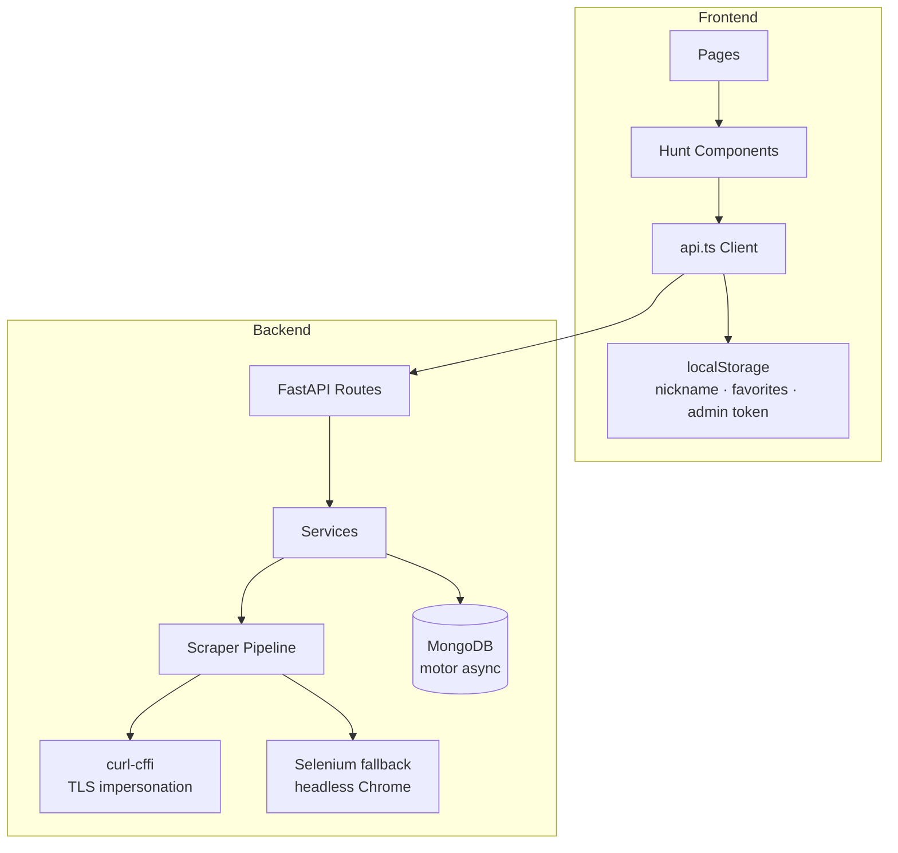

---

## 👤 User Flow

```mermaid
flowchart TD
    A([Start]) --> B[Landing Page /]
    B --> C[Click Lessego!]
    C --> D[POST /api/sessions\ncreate session UUID]
    D --> E[/hunt/sessionId — Home Tab]
    E --> F[Enter Nickname]
    F --> G[Paste Property URL]
    G --> H{reCAPTCHA score\n>= 0.5?}
    H -->|No| I[Blocked — Error toast]
    H -->|Yes| J[POST /api/scrape]
    J --> K{Supported site?}
    K -->|mudah.my| L[curl-cffi scrape]
    K -->|PropertyGuru / iProperty| M[Selenium fallback]
    L --> N[Property added → Properties Tab]
    M --> N
    N --> O{User action?}
    O -->|Shortlist or Reject| P[PATCH status]
    O -->|Delete| Q[DELETE property]
    O -->|Favourite| R[Save to localStorage]
    O -->|Print PDF| S[Browser print dialog]
    O -->|Go to Insight| T[Bracket Tournament]
    T --> U[Head-to-head voting]
    U --> V{Final match?}
    V -->|No| U
    V -->|Yes| W[Confetti + Winner card]
    W --> X([Done])
```

### Page Map

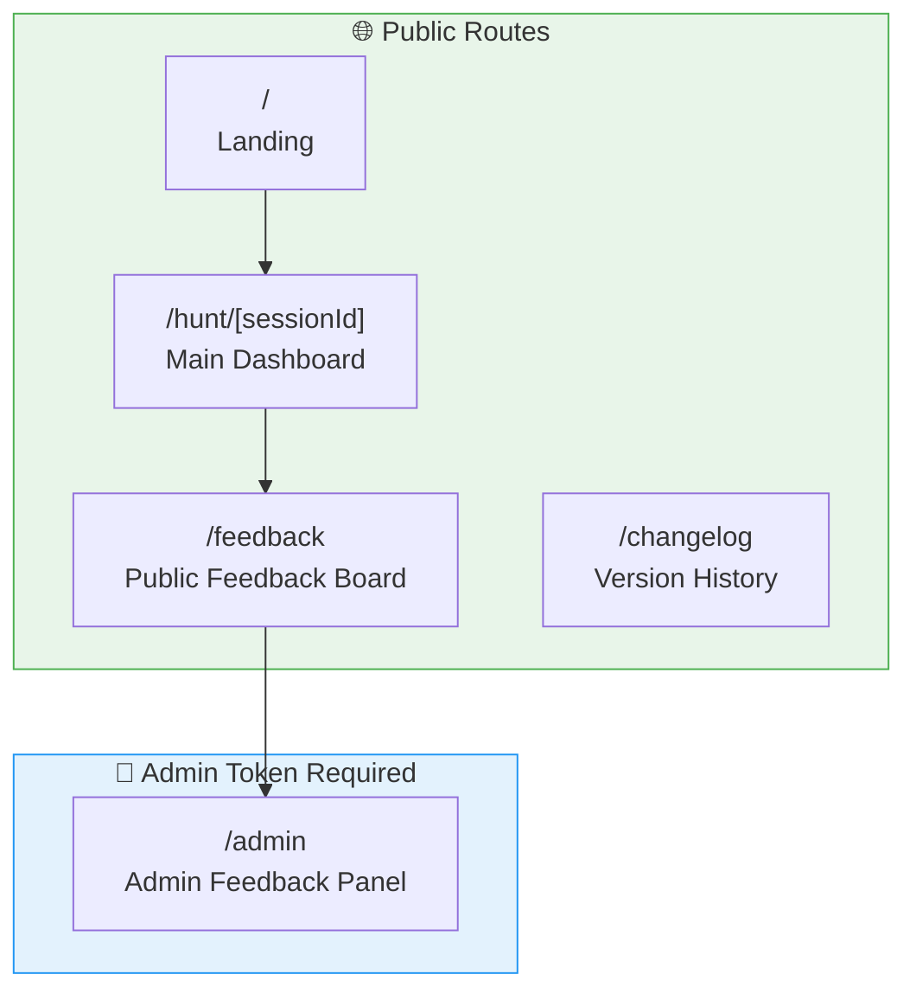

### Wireframe Overview

```mermaid
graph TD
    subgraph Hunt ["📄 /hunt/[sessionId]"]
        H1["NavBar — tabs · share link · online members · expiry countdown"]
        H2["Home Tab — URL input · reCAPTCHA · scrape button · backend health"]
        H3["Properties Tab — property list ↔ property detail (split layout)"]
        H4["Insight Tab — bracket tournament · head-to-head voting · confetti"]
        H1 --> H2 --> H3 --> H4
    end
    subgraph Landing ["📄 /"]
        L1["Hero section + CTA button"]
        L2["Lessego! → creates session → redirect"]
        L1 --> L2
    end
    subgraph Feedback ["📄 /feedback"]
        F1["Public replies list (admin-replied only)"]
    end
    subgraph Admin ["📄 /admin"]
        A1["Token login gate"]
        A2["All feedback + unread badge"]
        A3["Reply modal per feedback item"]
        A1 --> A2 --> A3
    end
```

---

## 🔐 Auth & Session Flow

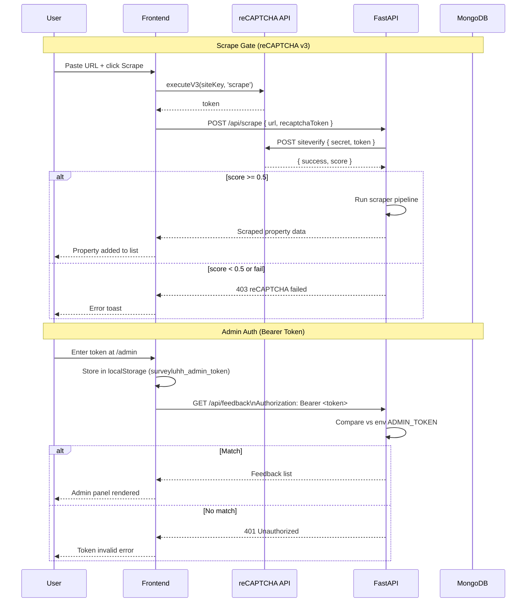

---

## 🗄️ Database (ERD)

### Core ERD

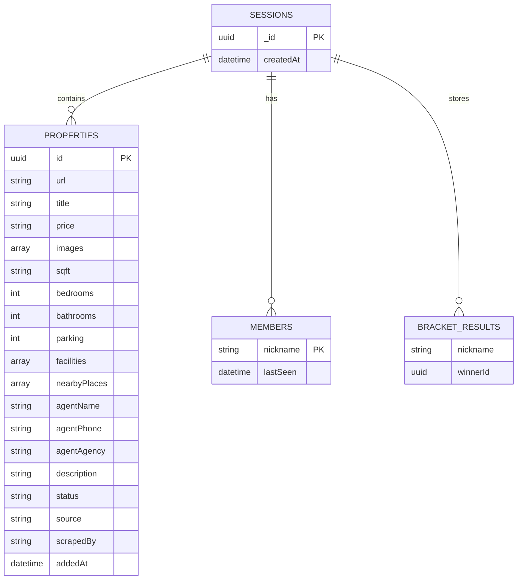

### Feature ERD

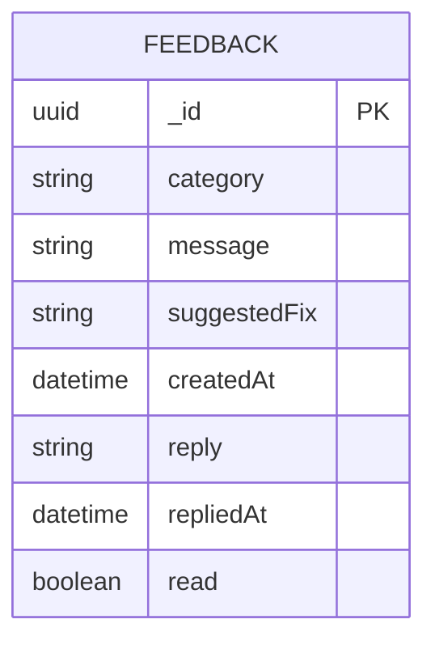

### Database Schema Overview

| Collection | Purpose | Key Relations |
|---|---|---|
| `sessions` | Session container (TTL 7 days) | — |
| `sessions.properties` | Embedded property array | belongs to `sessions` |
| `sessions.members` | Embedded members array (online tracking) | belongs to `sessions` |
| `sessions.bracketResults` | Embedded bracket votes per nickname | belongs to `sessions` |
| `feedback` | Anonymous user feedback + admin replies | standalone |

---

## 🔌 API Structure

### API Overview

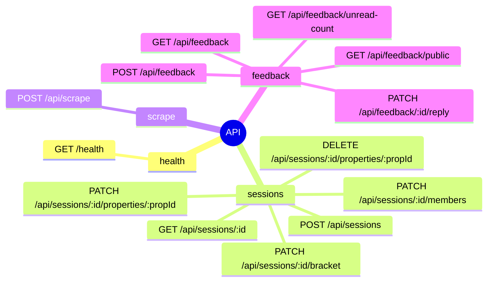

### Request/Response Flow

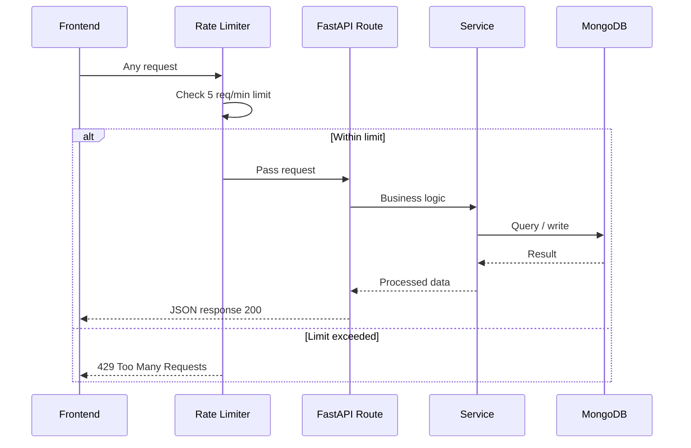

---

## 🧩 Frontend Components

### Component Tree

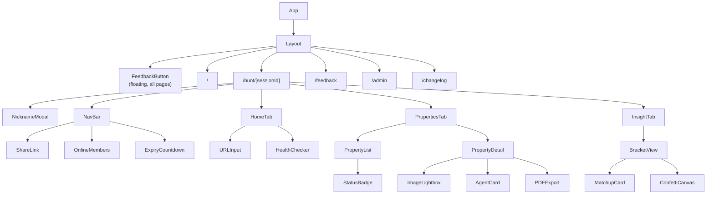

### Key Components

| Component | Purpose |
|---|---|
| `HomeTab` | URL input, reCAPTCHA trigger, scrape call, backend health check |
| `PropertiesTab` | Split-view list + detail; responsive swipe on mobile |
| `PropertyList` | Searchable list with shortlist/reject/delete actions |
| `PropertyDetail` | Full property card — images, agent info, PDF, favourites |
| `InsightTab` | Bracket tournament logic, head-to-head vote, confetti on win |
| `NavBar` | Tab switcher, share link copy, online member list, session countdown |
| `NicknameModal` | Prompt on first visit, stores name to localStorage |
| `FeedbackButton` | Floating button, feedback modal with category + message |

---

## ⚙️ Feature-specific Flows

### Scraping Pipeline Flow

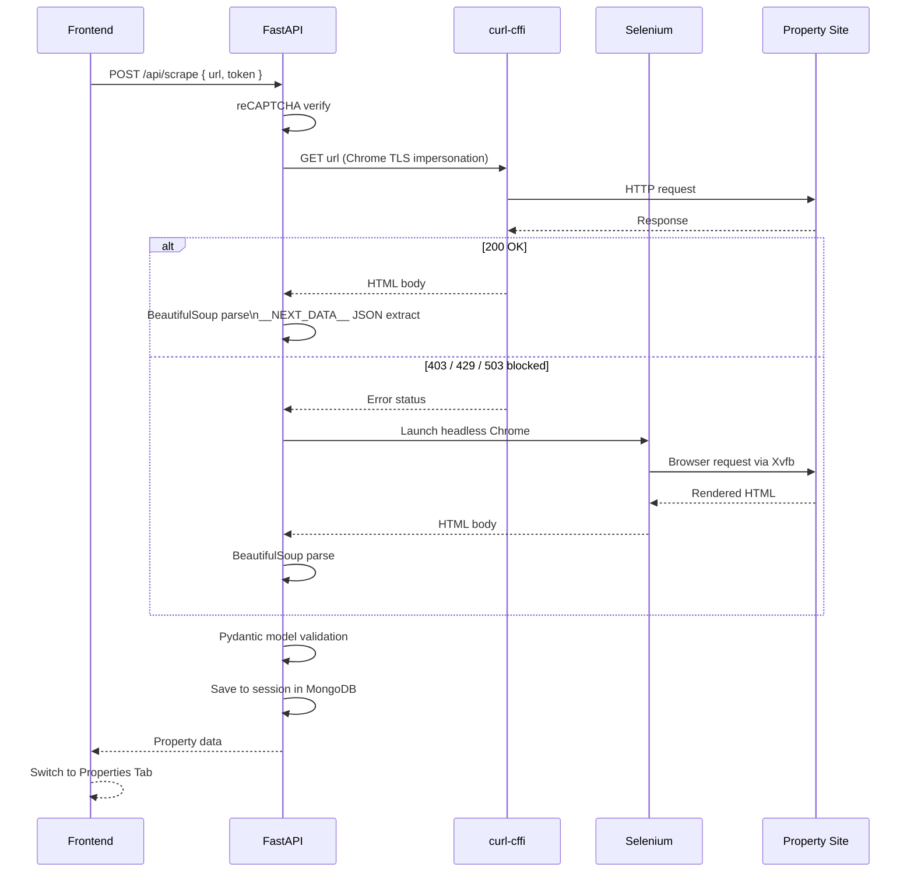

### Bracket Tournament Flow

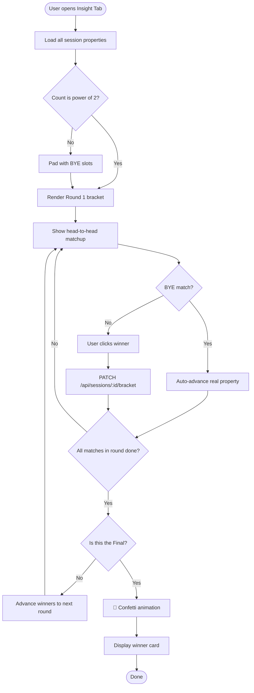

### Feedback & Admin Flow

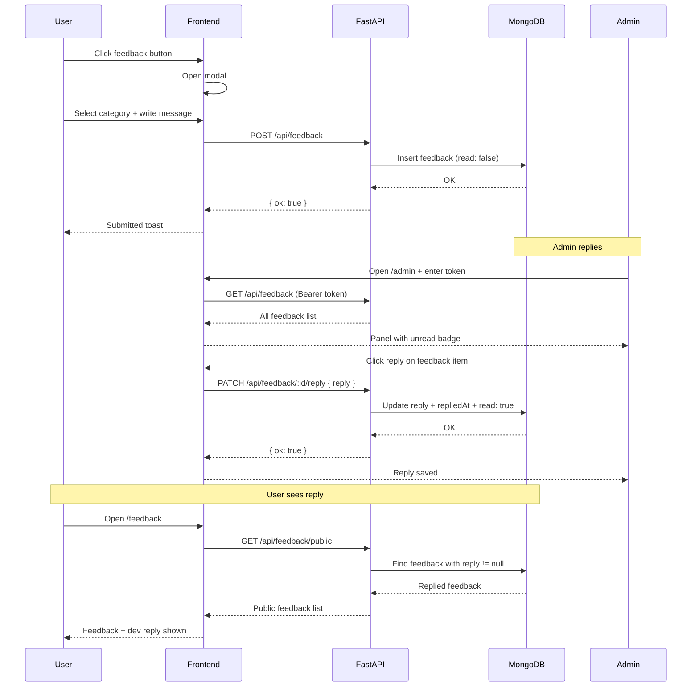

---

## 🚀 Getting Started

### Prerequisites

- Node.js `>=18`
- Python `>=3.11`
- Docker + Docker Compose
- Google reCAPTCHA v3 site + secret key

### Installation

```bash
git clone https://github.com/snsyaqirah/SurveyLuhh.git
cd SurveyLuhh
```

### Running with Docker (Recommended)

```bash
# Copy env files
cp .env.example .env

# Start all services (MongoDB + Selenium + API + Frontend)
docker compose up --build
```

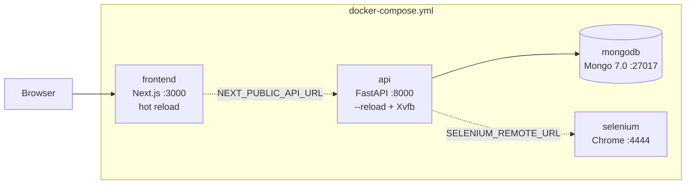

| Service | URL |
|---|---|
| Frontend | http://localhost:3000 |
| Backend | http://localhost:8000 |
| API Docs | http://localhost:8000/docs |
| MongoDB | localhost:27017 |
| Selenium | http://localhost:4444 |

### Running locally (without Docker)

```bash
# Backend
cd backend
pip install -r requirements.txt
uvicorn main:app --reload --port 8000

# Frontend (separate terminal)
cd frontend
npm install
npm run dev
```

> You'll need a running MongoDB instance and optionally a Selenium Grid for full scraping support.

---

## 🔑 Environment Variables

### Backend

```env
# Database
MONGODB_URI=mongodb+srv://<user>:<password>@<cluster>.mongodb.net/surveyluhh

# reCAPTCHA
RECAPTCHA_SECRET_KEY=your_recaptcha_secret_key_here

# CORS
ALLOWED_ORIGINS=http://localhost:3000

# Selenium (Docker sets this automatically)
SELENIUM_REMOTE_URL=http://selenium:4444/wd/hub

# Admin panel
ADMIN_TOKEN=your_secret_admin_token_here
```

### Frontend

```env
NEXT_PUBLIC_API_URL=http://localhost:8000
NEXT_PUBLIC_RECAPTCHA_SITE_KEY=your_recaptcha_site_key_here
```

> Copy `.env.example` to `.env` and fill in your values.

---

## ☁️ Deployment

| Service | Purpose |
|---|---|
| Vercel / Railway | Frontend hosting |
| Railway / Render | Backend hosting (needs Chrome/Xvfb support) |
| MongoDB Atlas | Cloud database |

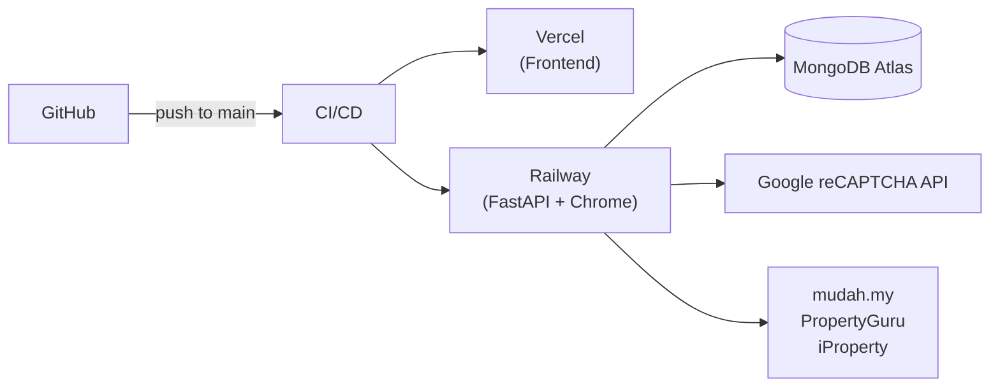

> **Note:** The backend requires Chrome and Xvfb. Use a platform that supports Docker (Railway, Render) rather than serverless functions.

---

## 📁 Project Structure

```
SurveyLuhh/
├── docker-compose.yml
├── .env.example
│
├── frontend/
│   ├── app/
│   │   ├── page.tsx                  # Landing page
│   │   ├── layout.tsx                # Root layout
│   │   ├── hunt/[sessionId]/
│   │   │   └── page.tsx             # Main hunt dashboard
│   │   ├── feedback/page.tsx         # Public feedback board
│   │   ├── admin/page.tsx            # Admin panel
│   │   └── changelog/page.tsx        # Changelog
│   ├── components/
│   │   ├── FeedbackButton.tsx
│   │   ├── hunt/
│   │   │   ├── HomeTab.tsx
│   │   │   ├── PropertiesTab.tsx
│   │   │   ├── PropertyDetail.tsx
│   │   │   ├── PropertyList.tsx
│   │   │   ├── InsightTab.tsx
│   │   │   ├── NavBar.tsx
│   │   │   └── NicknameModal.tsx
│   │   └── landing/
│   ├── lib/
│   │   ├── api.ts                    # API client
│   │   └── types.ts                  # TypeScript interfaces
│   ├── package.json
│   └── Dockerfile
│
└── backend/
    ├── main.py                       # App entry, CORS, rate limiter
    ├── models/
    │   ├── property.py               # Session, Property, Member models
    │   └── feedback.py               # Feedback models
    ├── routers/
    │   ├── sessions.py
    │   ├── scrape.py
    │   └── feedback.py
    ├── services/
    │   ├── db.py                     # MongoDB client + TTL setup
    │   └── scraper/
    │       ├── base.py               # curl-cffi + Selenium fetcher
    │       ├── mudah.py
    │       ├── propertyguru.py
    │       └── iproperty.py
    ├── requirements.txt
    └── Dockerfile
```

---

## 🗺 Roadmap

- [x] Session creation + shareable link
- [x] mudah.my scraping (curl-cffi)
- [x] PropertyGuru + iProperty scraping (Selenium fallback)
- [x] Collaborative property list with member tracking
- [x] Shortlist / Reject / Delete status
- [x] Bracket tournament with confetti
- [x] Favourites (localStorage)
- [x] PDF export
- [x] Anonymous feedback system + admin reply panel
- [x] Docker Compose setup
- [ ] WebSocket real-time sync (replace 30s polling)
- [ ] Full PropertyGuru scraping (Cloudflare bypass)
- [ ] Full iProperty scraping (Akamai bypass)
- [ ] Price history tracking
- [ ] Map view for nearby places
- [ ] Email session link

---

## 📄 License

[MIT](LICENSE) © 2025 Syaqirah
